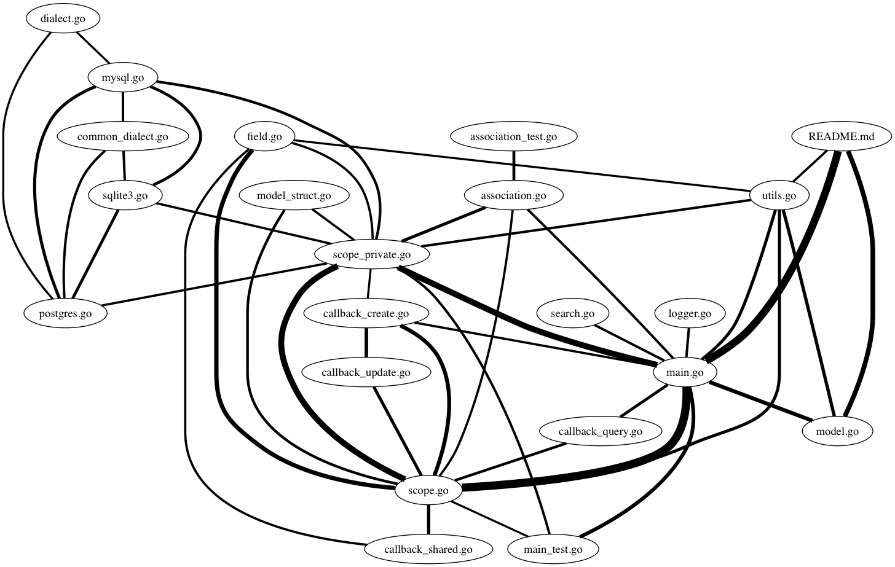

git-activity
============

Overview
--------

git-activity infers relationships between files in a git repository.

It outputs dot data that can be rendered using graphviz like so:

  git-activity | graphviz -Tpdf -o graph.pdf

It executes git command-line programs, so they need to be installed for this
tool to work. You also need to run this tool in the repository you'd like to
analyse.

The way git-activity determines relationships is by looking at the commit
history of a repository and recording, against each file, a list of other
files that have been edited in the same commit, along with the number of times
this has happened.

Example
-------

> $ cd $GOPATH/src/github.com/jinzhu/gorm
> $ git-activity -min_occurence 10 | dot -Tpng -o graph.png

License
-------

3-clause BSD. A copy is included with the source.
